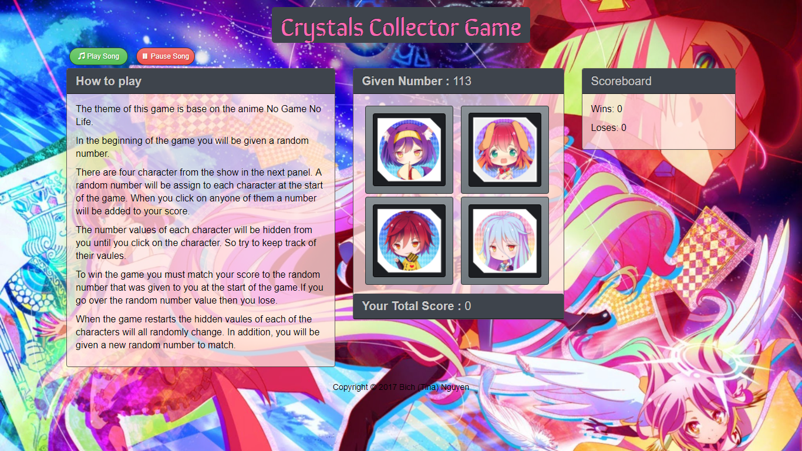

# Crystal Collector Game
A game that use Javascript and jQuery. Goal of the game is to get your given number to match your current score. 
The theme of the game is base on the anime No Game No Life. 
There will be four characters displayed as buttons on the page. The player will be shown a random number at the start of the game. When the player clicks on a crystal, it will add a specific amount of points to the player's total score.The player wins if their total score matches the random number from the beginning of the game. The player loses if their score goes above the random number. The game restarts whenever the player wins or loses. The app will show the number of games the player has wins and loses

Have some fun and try it out :https://redpanda117.github.io/CrystalCollectorGame/

